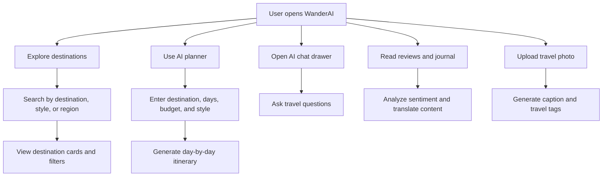
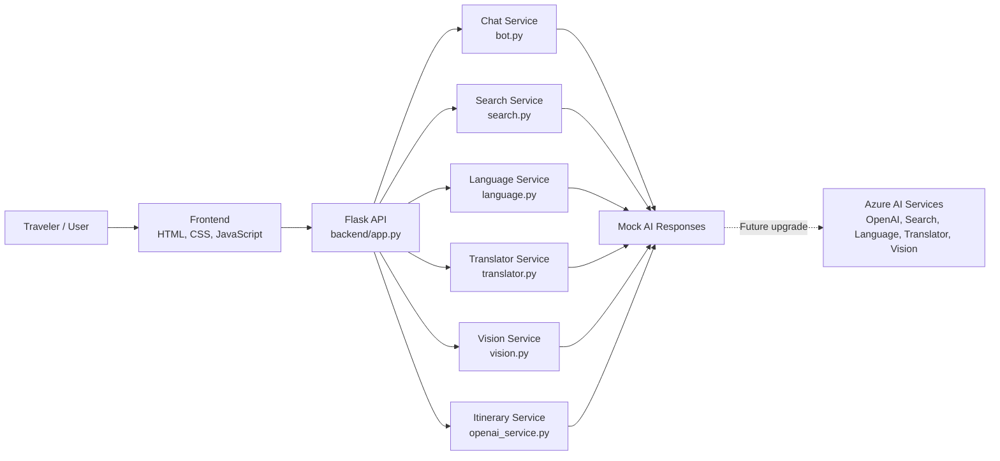
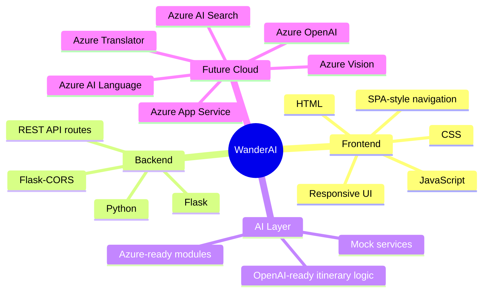
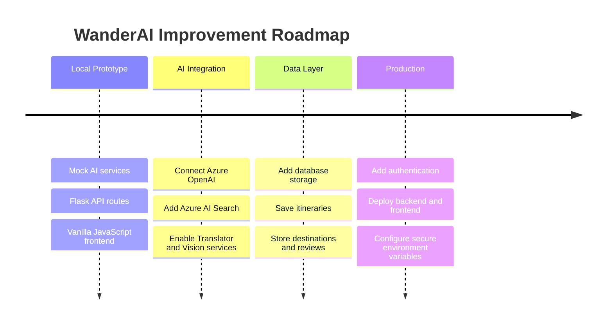

# GitHub About

Use this file as the enhanced GitHub project overview and as copy-ready content for the repository sidebar.

## Project Name

```text
WanderAI
```

## Project Tagline

```text
AI-powered luxury travel planning with search, chat, itinerary generation, translation, sentiment analysis, and image captions.
```

## Copy For GitHub Sidebar

| Field | Content |
| --- | --- |
| Repository description | AI-powered luxury travel planning website built with Flask, vanilla JavaScript, and Azure-ready service modules. |
| Website | Add your deployed website URL here |
| Topics | `flask`, `python`, `javascript`, `html-css`, `travel-website`, `azure-ai`, `ai-chatbot`, `itinerary-planner`, `responsive-design`, `full-stack-web-app` |

## Website Placeholder

Use this space for the final deployed website link:

```text
Website: Add your deployed website URL here
```

Suggested format after deployment:

```text
Website: https://your-deployed-wanderai-link.com
```

## Short About

WanderAI is an AI-powered luxury travel planning web app with destination search, itinerary generation, chatbot support, multilingual travel content, review sentiment, image captioning, and an Azure-ready Flask backend.

## Detailed About

WanderAI is a full-stack AI-powered luxury travel planning website designed to feel like a modern digital travel concierge. It helps users explore curated destinations, search for travel ideas, generate day-by-day itineraries, analyze traveler reviews, translate travel journal content, and create AI-style captions for uploaded travel photos.

The frontend is built with HTML, CSS, and vanilla JavaScript. It uses a cinematic single-page layout with responsive sections, animated destination cards, filter controls, smooth loading states, a floating chatbot drawer, an itinerary planner, multilingual journal content, and a drag-and-drop image analysis experience.

The backend is built with Python Flask and exposes clean API routes for chat, search, destinations, itinerary generation, sentiment analysis, entity extraction, translation, and image analysis. Each AI-related capability is separated into a focused service module, making the project easier to understand, maintain, and extend.

The project currently runs with mock-backed AI responses, so it can be tested locally without cloud credentials or paid API keys. The service structure is Azure-ready and can be connected later to Azure OpenAI, Azure AI Search, Azure AI Language, Azure Translator, and Azure Vision.

## Portfolio Summary

WanderAI shows how a modern travel-tech product can be prototyped as a complete full-stack application. It is not only a static website; it includes frontend interactions, backend API routes, modular AI service files, mock response handling, and a future-ready cloud integration path.

The project is suitable for:

- GitHub portfolio presentation
- Academic project submission
- Flask and JavaScript full-stack demonstration
- Azure AI integration planning
- Travel-tech product prototype demos

## Project Flow



## Architecture Flowchart



## Feature Map

| Feature | What It Does | Current Implementation | Future Azure Service |
| --- | --- | --- | --- |
| Destination Search | Suggests travel destinations based on user input | Mock destination search service | Azure AI Search |
| AI Chatbot | Answers travel-related questions in a concierge style | Mock chatbot service | Azure OpenAI |
| Itinerary Planner | Builds day-by-day trip plans from destination, duration, budget, and style | Mock itinerary generation | Azure OpenAI |
| Review Sentiment | Labels travel reviews by emotional tone | Mock sentiment analysis | Azure AI Language |
| Entity Extraction | Finds important travel-related entities in text | Mock entity extraction | Azure AI Language |
| Translation | Converts travel journal content into selected languages | Mock translation service | Azure Translator |
| Image Captioning | Creates captions and tags for uploaded travel photos | Mock image analysis | Azure Vision |

## Tech Stack



## Why This Project Stands Out

- It presents a complete travel-tech product idea, not just a static landing page.
- It includes multiple AI-inspired features across search, chat, language, vision, and planning.
- It keeps the backend modular so each feature can be upgraded independently.
- It runs locally without requiring secret keys, paid APIs, or cloud setup.
- It is structured for future Azure AI integration and deployment.
- It is suitable for GitHub, portfolio presentation, academic submission, and demo walkthroughs.

## Repository Value

This project demonstrates practical full-stack development skills through a polished and readable codebase. It shows how a frontend can communicate with a backend API, how AI capabilities can be organized into service modules, and how a mock-backed prototype can be prepared for production cloud services later.

WanderAI can be expanded into a real travel planning platform by adding authentication, saved itineraries, database-backed destinations, user review storage, payment or booking flows, and production Azure AI integrations.

## Suggested Demo Walkthrough

1. Open the WanderAI homepage and show the cinematic travel interface.
2. Use destination search to demonstrate API-driven suggestions.
3. Filter destination cards by travel type, region, or rating.
4. Open the chatbot drawer and ask for travel recommendations.
5. Generate an itinerary using destination, duration, budget, and style.
6. Show review sentiment and multilingual journal translation.
7. Upload a travel image and display the generated caption and tags.
8. Explain how the Flask backend can later connect to real Azure AI services.

## Suggested README Pitch

```text
WanderAI is a full-stack AI-powered luxury travel planning website. It combines a cinematic travel interface with AI-inspired destination search, itinerary generation, chatbot support, multilingual journal content, sentiment-aware reviews, and image captioning. The Flask backend is organized into Azure-ready service modules, allowing the current mock AI behavior to be replaced with real Azure AI integrations in the future.
```

## Suggested LinkedIn Or Portfolio Description

```text
Built WanderAI, a full-stack AI-powered luxury travel planning website using Flask, HTML, CSS, and JavaScript. The app includes destination search, itinerary generation, chatbot support, multilingual journal content, review sentiment, image captioning, and an Azure-ready backend service architecture.
```

## Suggested Commit Message

```text
Enhance GitHub About documentation
```

## Roadmap


