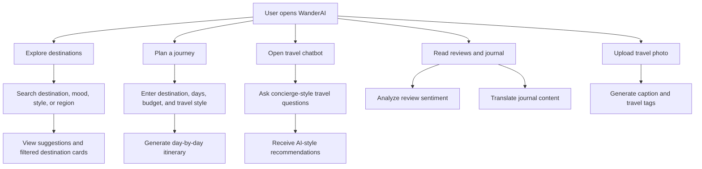
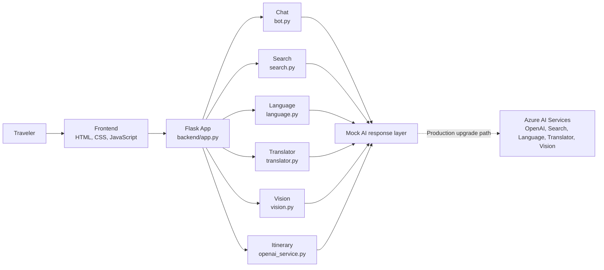
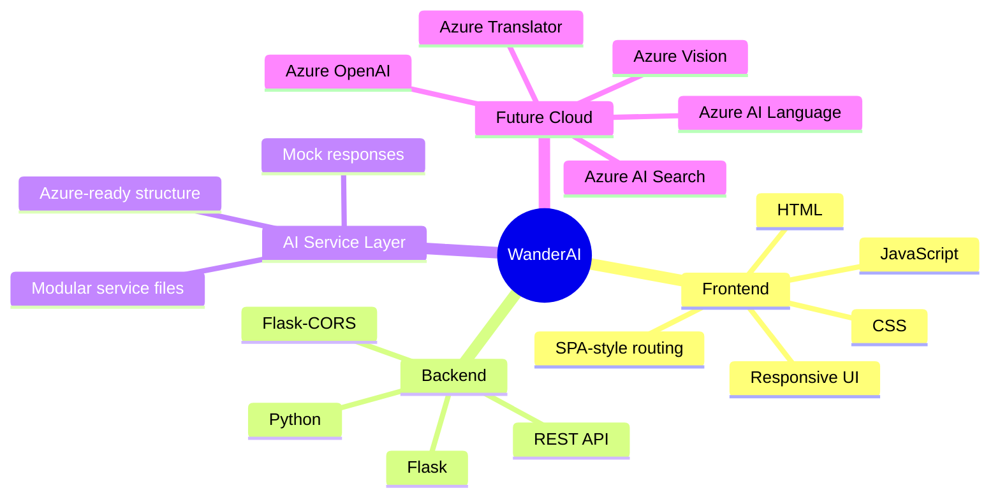
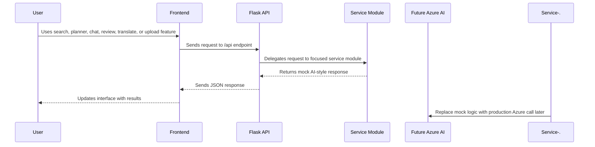
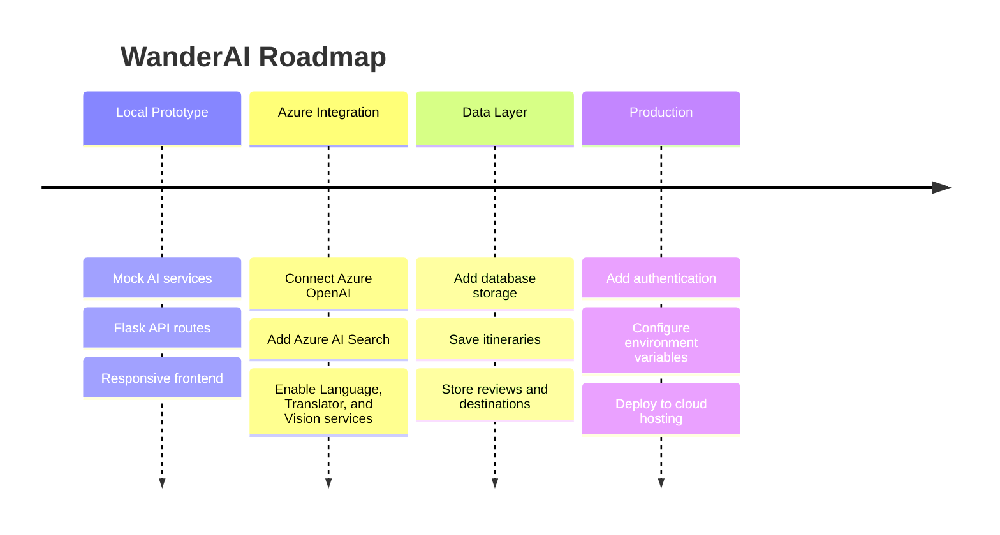

# WanderAI

WanderAI is a full-stack AI-powered luxury travel planning website. It combines a cinematic travel interface with AI-inspired destination search, itinerary generation, chatbot support, multilingual travel content, review sentiment, and photo captioning.

The frontend is built with HTML, CSS, and vanilla JavaScript. The backend is built with Python Flask and organized into Azure-ready service modules, so the project runs locally with mock AI responses and can later be connected to real Azure AI services.

## Live Website

Website link: _Add your deployed website URL here_

```text
https://your-wanderai-website-link.com
```

## Table of Contents

- [Overview](#overview)
- [Core Features](#core-features)
- [Project Flow](#project-flow)
- [Architecture](#architecture)
- [Tech Stack](#tech-stack)
- [Project Structure](#project-structure)
- [Local Setup](#local-setup)
- [API Reference](#api-reference)
- [Azure Readiness](#azure-readiness)
- [Roadmap](#roadmap)

## Overview

WanderAI is designed as a premium digital travel concierge. A user can discover destination ideas, filter curated travel cards, ask a chatbot for recommendations, generate a day-by-day itinerary, read travel reviews with sentiment labels, translate journal content, and upload a travel image for AI-style captions and tags.

The current version is mock-backed, which means it does not require real Azure credentials or paid API keys. This keeps the app easy to run locally while still showing how the frontend and backend would connect to production AI services later.

## Core Features

| Feature | Description |
| --- | --- |
| AI destination search | Suggests destinations based on user input, region, style, or mood |
| Destination filters | Lets users browse curated cards by category, rating, region, and travel type |
| AI chatbot drawer | Provides a concierge-style travel assistant inside the app |
| Itinerary planner | Generates a day-by-day travel plan from destination, duration, budget, and style |
| Review intelligence | Displays travel reviews with sentiment-aware labels |
| Multilingual journal | Translates travel content into supported languages |
| Vision gallery | Accepts image uploads and returns AI-style captions and tags |
| Responsive UI | Uses polished layouts, loading states, toast notifications, and mobile-friendly interactions |

## Project Flow



## Architecture



## Tech Stack



## Project Structure

```text
.
├── README.md
├── GITHUB_ABOUT.md
├── LICENSE
├── CONTRIBUTING.md
├── backend/
│   ├── app.py
│   ├── config.py
│   ├── requirements.txt
│   └── services/
│       ├── bot.py
│       ├── language.py
│       ├── openai_service.py
│       ├── search.py
│       ├── translator.py
│       └── vision.py
└── frontend/
    ├── index.html
    ├── main.js
    └── style.css
```

## Folder Responsibilities

| Path | Purpose |
| --- | --- |
| `frontend/index.html` | Main single-page interface |
| `frontend/style.css` | Visual design, responsive layout, animations, and component styling |
| `frontend/main.js` | Client-side interactions, API calls, routing behavior, and UI state |
| `backend/app.py` | Flask server, static frontend serving, and API route definitions |
| `backend/config.py` | Placeholder configuration for future Azure service credentials |
| `backend/services/` | Modular AI-style service logic for chat, search, language, translation, vision, and itinerary generation |
| `GITHUB_ABOUT.md` | Copy-ready GitHub repository About content and project metadata |

## Local Setup

1. Create and activate a virtual environment:

```bash
python3 -m venv .venv
source .venv/bin/activate
```

2. Install backend dependencies:

```bash
pip install -r backend/requirements.txt
```

3. Run the Flask backend:

```bash
python backend/app.py
```

4. Open the app:

```text
http://localhost:5000
```

If port `5000` is already in use on macOS, check whether AirPlay Receiver is using it or change the port in `backend/app.py`.

## API Reference

| Method | Endpoint | Purpose |
| --- | --- | --- |
| `GET` | `/` | Serves the WanderAI frontend |
| `GET` | `/api/destinations` | Returns destination card data |
| `GET` | `/api/search?q=` | Returns destination suggestions |
| `POST` | `/api/chat` | Sends user messages to the travel chatbot service |
| `POST` | `/api/itinerary` | Generates a day-by-day itinerary |
| `POST` | `/api/sentiment` | Analyzes review sentiment |
| `POST` | `/api/entities` | Extracts travel-related entities from text |
| `POST` | `/api/translate` | Translates travel journal text |
| `POST` | `/api/vision` | Analyzes uploaded image data and returns caption details |

## Azure Readiness

All Azure placeholders live in `backend/config.py`. Do not put credentials in frontend files.

| Current Module | Current Behavior | Future Azure Service |
| --- | --- | --- |
| `bot.py` | Mock concierge chatbot response | Azure OpenAI |
| `openai_service.py` | Mock itinerary generation | Azure OpenAI |
| `search.py` | Mock destination search | Azure AI Search |
| `language.py` | Mock sentiment and entity analysis | Azure AI Language |
| `translator.py` | Mock translation response | Azure Translator |
| `vision.py` | Mock image captioning and tags | Azure Vision |

## Data Flow



## GitHub Notes

- Generated Python cache files and local environments are ignored by `.gitignore`.
- No real API keys or secrets are included.
- The frontend is served by Flask from the `frontend/` directory.
- Use `GITHUB_ABOUT.md` for repository sidebar content, topics, website placeholder, and longer GitHub project description.

## Roadmap



## Future Improvements

- Connect the service modules to real Azure AI resources
- Add user authentication and saved itineraries
- Store destinations, reviews, and journal content in a database
- Add deployment configuration for Azure App Service or another hosting provider
- Add automated tests for API routes and service modules
